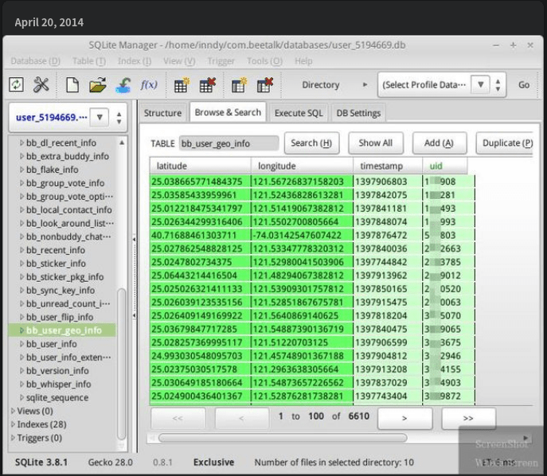
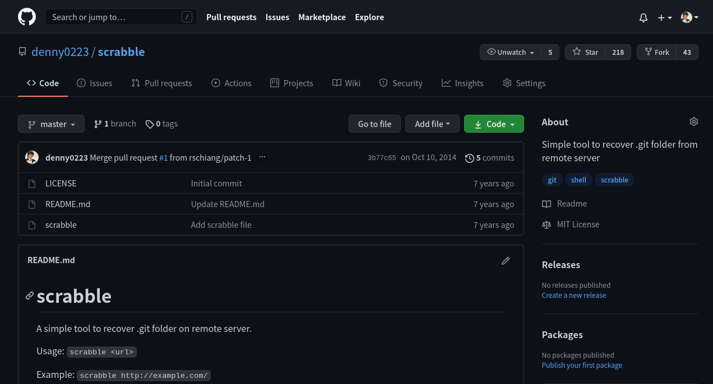
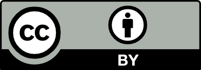

title: CYBERSEC 2021
output: index.html
style: style.css
theme: sjaakvandenberg/cleaver-dark

--
##### 下頁開始

-- cover

--

# 資安職場戰力與心志養成
## Cyber Talent Forum 資安人才論壇

 
## Denny Huang

--

### Who am I ?

 
## **Denny Huang**

* SITCON 學生計算機年會共同發起人

* 雷亞遊戲 Rayark Inc. Data Team Lead

* COSCUP 開源人年會 2021 總召組

* HITCON 台灣駭客年會 2021 副總召

* <a href="http://denny.one/" target="_blank">About me</a>

--

# Data Team Lead?

--

 
 

## BeeTalk

--

 
 

## [scrabble](https://github.com/denny0223/scrabble)

--

# 駭客精神

--

# 重造輪子

--

# 保護自己
## [HITCON Zeroday](https://zeroday.hitcon.org/)

--

# [社群](https://hackmd.io/@SITCON/floss-community-list)

--

# 參與

--

# 貢獻

--

# Hacker School

--

# SITCON
## 5/29

--

# COSCUP
## 7/31, 8/1

-- hitcon1

-- hitcon2

--

# Q & A

--

# Thanks for listening!

   

  

<h2 style="font-size: 18px">
本投影片採用<a href="https://creativecommons.org/licenses/by/4.0/deed.zh_TW" target="_blank">創用 CC「姓名標示 4.0 國際」授權條款</a>
</h2>

